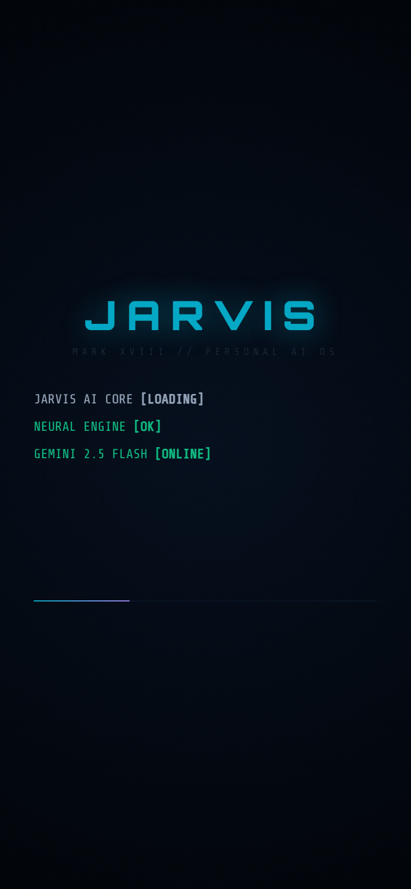
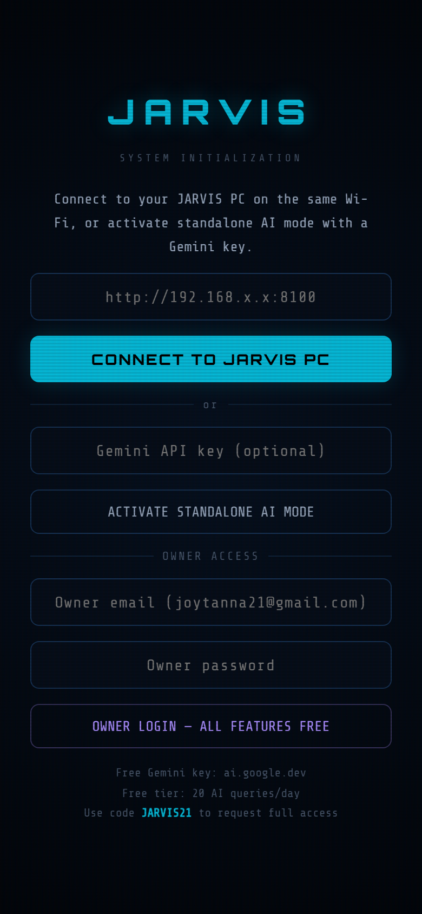
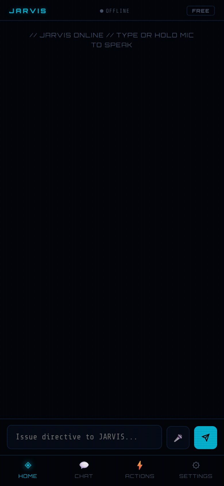
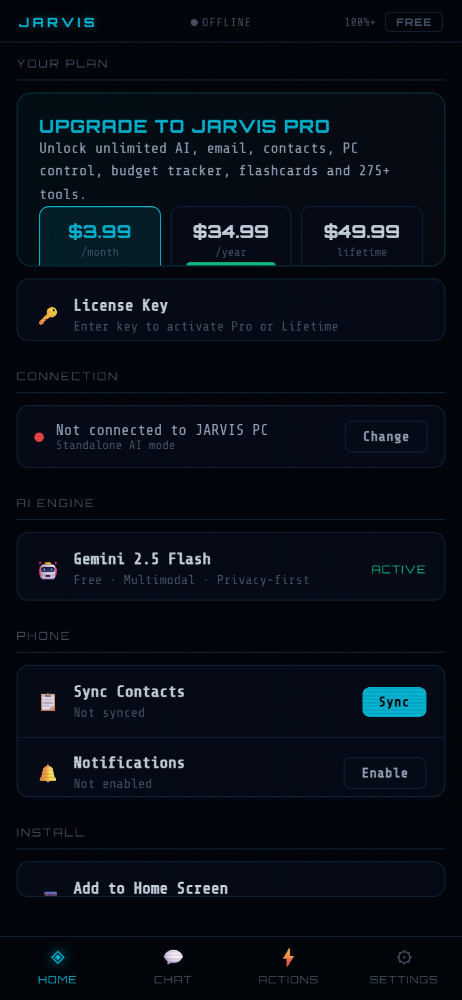

# JARVIS AI — Personal AI Assistant

> Your own Iron Man-style AI. Runs on your Windows PC, controls it remotely from your phone.



---

## What it does

- **275+ tools** — weather, email, contacts, PC control, budgeting, flashcards, stocks, timers, alarms, notes, and more
- **Voice + chat** — talk or type from your PC or phone
- **Android app** — control your PC from anywhere on the same Wi-Fi
- **Gemini 2.5 Flash** AI brain (free API key from Google)
- **Standalone mode** — works without a PC connection using just a Gemini key

---

## Quick Start (Windows)

### Requirements
- Windows 10/11
- Python 3.10+ ([download](https://python.org)) — check **"Add Python to PATH"**

### Install
1. [Download the latest release](https://github.com/joytanna/JARVISCore/releases/latest)
2. Extract the ZIP
3. Double-click **`SETUP.bat`**
4. Follow the wizard — takes about 2 minutes
5. JARVIS opens automatically in your browser

### Android App
1. Open **`http://YOUR-PC-IP:8765/android`** on your phone
2. Tap **"Add to Home Screen"** → install as an app
3. Enter your PC's IP address in the setup screen

---

## Plans & Pricing

| Plan | Price | Queries/day | Tools |
|------|-------|-------------|-------|
| Free | $0 | 20 | Basic (weather, timer, calculator, etc.) |
| Pro | $3.99/mo or $34.99/yr | Unlimited | All 275+ tools |
| Lifetime | $49.99 one-time | Unlimited | All 275+ tools forever |

> Use code **`LAUNCH2026`** for 40% off Pro.
> Use code **`JARVIS21`** to request full access (email approval by owner).

---

## Screenshots

| Boot | Setup | Chat | Settings |
|------|-------|------|----------|
|  |  |  |  |

---

## Configuration (`.env`)

```env
GEMINI_API_KEY=your_key_here        # Free at ai.google.dev
GROQ_API_KEY=optional               # Faster responses
ADMIN_EMAIL=your@email.com          # For JARVIS21 approval emails
API_PORT=8765
```

---

## License

Personal use. All rights reserved © 2026 JARVIS AI.
